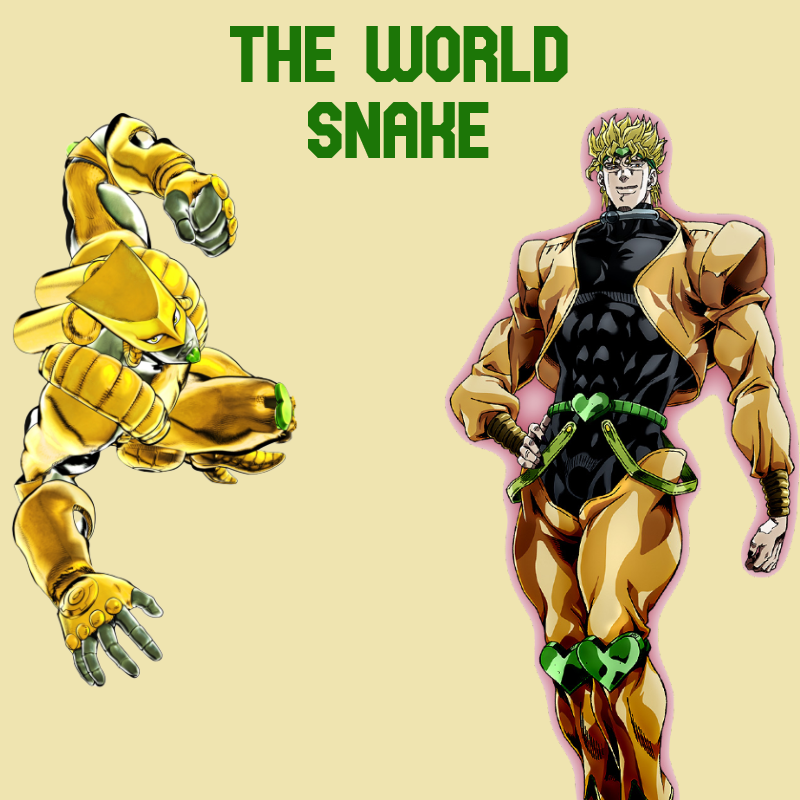
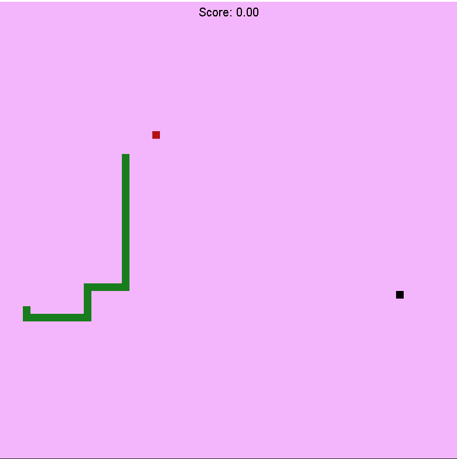
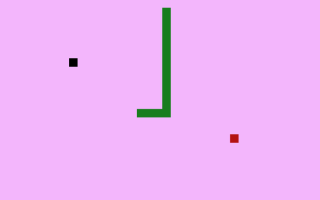
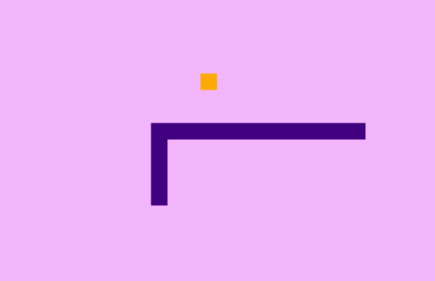
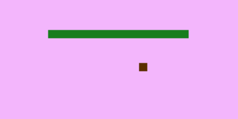

## Advanced Programming Project 1 - The World Snake

The classic snake game with a *Jojo's Biazzare Adventure: Stardust Crusaders* twist 
added to it. Your goal is to eat as many apples (red squares) as possible without 
crashing into yourself; when you crash into walls you appear on the opposite side.

 

 

 
 

 

When you eat the Za Warudo power up (black square) your snake slows down 
for 9 seconds, making it easier to eat the apple. The snake and the apple
change color, and a sound effect plays when you eat the power up.

 

If you take too long to reach the apple it will rot, causing you to loose poins
when you eat it.

 

### **Controls:**
* Up = up arrow
* Down = down arrow
* Left = left arrow
* Rigth = right arrow
* Pause = ESC

 

###### Disclaimer: I do not own any of the images and sounds used in this project. They were only used for educational purposes.
